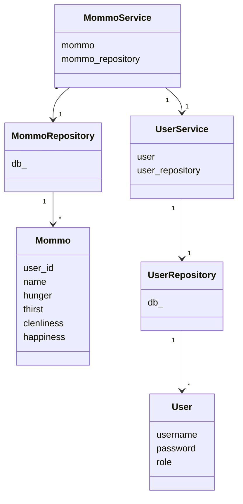

# Arkkitehtuuri

## Rakenne

Sovellus noudattaa kerrosarkkitehtuuri.

## Sovelluslogiikka
- ui-pakkaus vastaa käyttöliittymätoiminnoista ja kutsuu services-pakkauksen toimintoja.
- services-pakkaus vastaa sovelluslogiikasta ja kutsuu repositories pakkauksen toimintoja.
- repositories-pakkaus vastaa tietokantatoiminnoista.

- entities-pakkaus vastaa user- ja mommo-olioiden luomisesta. Services-pakkauksen meoduulit ja luokat
hoitavat sovelluslogiikkaa kutsumalla entities-pakkauksen toimintoja ja ylläpitämällä tietoa kirjautuneesta
käyttäjästä ja mömmöstä. Repositories pakkauksen moduulit kutsuvat entities-pakkauksen toimintoja palauttaakseen osan tuloksista user- ja mommo-olioina.

**Alla havainnollistava luokkakaavio:**

### Luokkakaavio

MommoService ja UserService hoitavat Mommo- ja User-olentoihin liittyviä toimintoja. Ne pääsevät olentoihin käsiksi MommoRepository- ja UserRepository-luokkien välityksellä. Nämä luokat käsittelevät suoraan Mommo- ja User-olentoihin liittyviä tietokantatoimintoja.

Lisäksi MommoService käyttää joitain UserServicen toimintoja.

## Käyttöliittymä

Käyttöliittymä sisältää seuraavat näkymät:
- päänäkymä (main_view)
- kirjautumisnäkymä (login_view)
- rekisteröitymisnäkymä (register_view)
- uusi mömmö -näkymä (new_mommo_view)
- mömmö-näkymä (mommo_view)
- kaikki mömmöt -näkymä (all_mommos_view)

Kaikkien näkymien lopullisesta näyttämisestä vastaa ui.py:n luokka UI.
