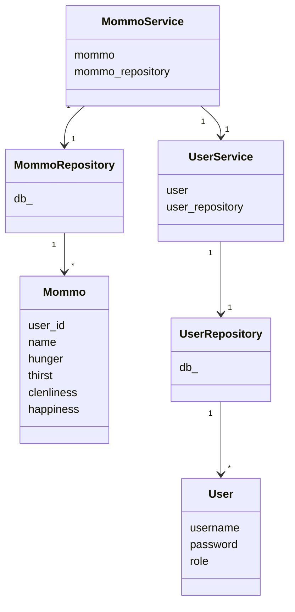

## Sovelluslogiikka

MommoService ja UserService hoitavat Mommo- ja User-olentoihin liittyviä toimintoja. Ne pääsevät olentoihin käsiksi MommoRepository- ja UserRepository-luokkien välityksellä. Nämä luokat käsittelevät suoraan Mommo- ja User-olentoihin liittyviä tietokantatoimintoja.

Lisäksi MommoService käyttää joitain UserServicen toimintoja.

