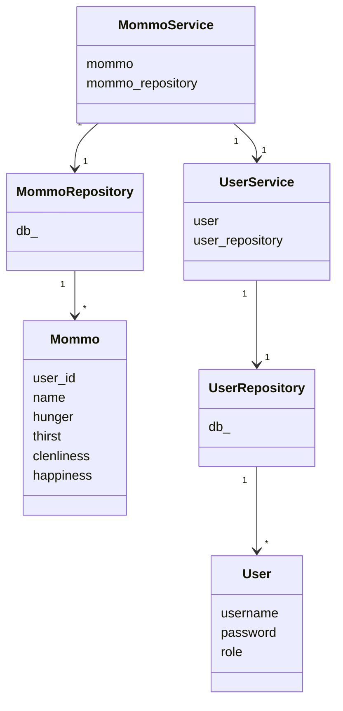

# Arkkitehtuuri

## Rakenne

Sovellus noudattaa kerrosarkkitehtuuri.

## Sovelluslogiikka
- ui-pakkaus vastaa käyttöliittymätoiminnoista ja kutsuu services-pakkauksen toimintoja.
- services-pakkaus vastaa sovelluslogiikasta ja kutsuu repositories pakkauksen toimintoja.
- repositories-pakkaus vastaa tietokantatoiminnoista.

- entities-pakkaus vastaa user- ja mommo-olioiden luomisesta. Services-pakkauksen moduulit ja luokat
hoitavat sovelluslogiikkaa kutsumalla entities-pakkauksen toimintoja ja ylläpitämällä tietoa kirjautuneesta
käyttäjästä ja mömmöstä. Repositories pakkauksen moduulit kutsuvat entities-pakkauksen toimintoja palauttaakseen osan tuloksista user- ja mommo-olioina.

**Alla havainnollistava luokkakaavio:**

### Luokkakaavio

`MommoService` ja `UserService` hoitavat Mommo- ja User-olentoihin liittyviä toimintoja. Ne pääsevät olentoihin käsiksi `MommoRepository` ja `UserRepository` -luokkien välityksellä. Nämä luokat käsittelevät suoraan Mommo- ja User-olentoihin liittyviä tietokantatoimintoja.

Lisäksi `MommoService` käyttää joitain `UserService`-luokan toimintoja.



## Käyttöliittymä

Käyttöliittymä sisältää seuraavat näkymät:
- Päänäkymä (luokka `MainView`)
- Kirjautumisnäkymä (luokka `LoginView`)
- Rekisteröitymisnäkymä (luokka `RegisterView`)
- Uusi mömmö -näkymä (luokka `NewMommoView`)
- Mömmö-näkymä (luokka `MommoView`)
- Kaikki mömmöt -näkymä (luokka `AllMommosView`)

Lisäksi käyttöliittymän muodostamiseen osallistuvat luokat `UiTheme` ja `DrawMommo`.

Kaikkien näkymien lopullisesta näyttämisestä vastaa `ui.py`:n luokka `UI`. Näkymät kutsuvat service-paketin toimintoja.

## Toiminnallisuus

**UserService-luokka**

Luokka vastaa käyttäjätoiminnallisuudesta.

**Funktioesimerkkejä**

```bash
create user(username, password, role)
```
- luo uuden käyttäjän ja kirjaa sen sisään.

```bash
login(username, password)
```
- kirjaa käyttäjän sisään
```bash
logout()
```
- kirjaa käyttäjän ulos

**MommoService-luokka**

Luokka vastaa mömmötoiminnallisuudesta ja hyödyntää säikeita
mömmön tilastojen muuttamiseen ajan kuluessa.

**Funktioesimerkkejä**

```bash
start()
```
- käynnistää säikeet

```bash
create_mommo(name)
```
- luo uuden mömmön
```bash
login_mommo(visit_user_id, visit)
```
- kirjaa mömmön sisään
```bash
logout_mommo()
```
- kirjaa mömmön ulos
```bash
feed_mommo()
```
- vähentää mömmön nälkäisyyttä.


**Säikeitä hyödyntävät funktiot**
```bash
increase_hunger()
```
```bash
increase_thirst()
```
```bash
decrease_clenliness()
```
```bash
decrease_happiness()
```

## Tiedon tallennus

**UserRepository-luokka**

Luokka vastaa käyttäjätietojen talletuksesta tietokantaan ja niiden hakemisesta.

**MommoRepository-luokka**

Luokka vastaa mömmötietojen talletuksesta tietokantaan ja niiden hakemisesta.
