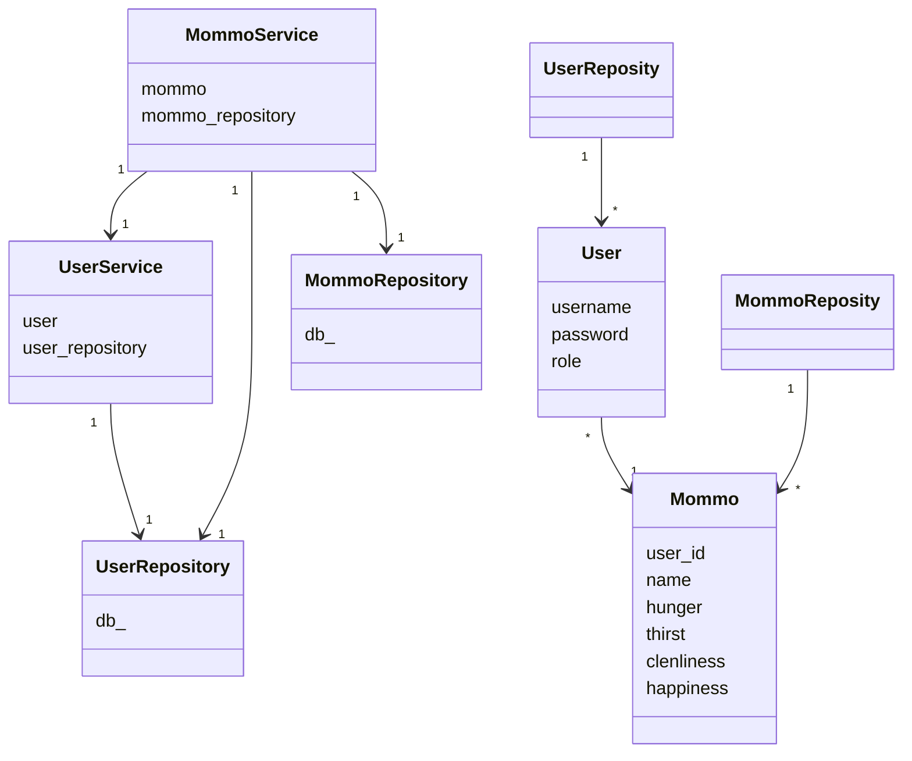

## Sovelluslogiikka

Selitys:

```mermaid
 classDiagram
      User "*" --> "1" Mommo
      class User{
          username
          password
          role
      }
      class Mommo{
          user_id
          name
          hunger
          thirst
          clenliness
          happiness
      }
      UserService "1" --> "1" UserRepository
      class UserService{
          user
          user_repository
      }
      MommoService "1" --> "1" MommoRepository
      MommoService "1" --> "1" UserRepository
      MommoService "1" --> "1" UserService
      class MommoService{
          mommo
          mommo_repository
      }
      UserReposity "1" --> "*" User
      class UserRepository{
          db_
      }
      MommoReposity "1" --> "*" Mommo
      class MommoRepository{
          db_
      }
```
