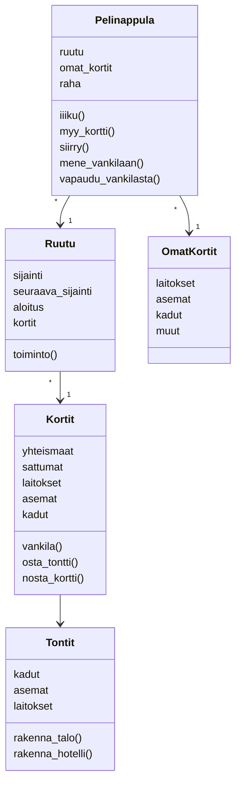

Pelin alussa luodaan yksi kortit olio, joka pitää kirjaa pelin korteista. Kortit-olio vastaa korttien toiminnoista ja siitä,
mikä kortti kuuluu kullekkin pelaajalle ja mitkä ovat vielä pakassa. Pelin alussa luodaan myös yksi Tontit-olio, joka pitää
kirjaa siitä, mikä tontti kuuluu kullekin pelaajalle.
Pelaajilla ei ole erillistä luokkaa tai moduulia vaan luodut Pelinappula-oliot kuvaavat pelaajia.
Jokaiseen Pelinappulaan liittyy Ruutu-olio ja OmatKortit-olio.

